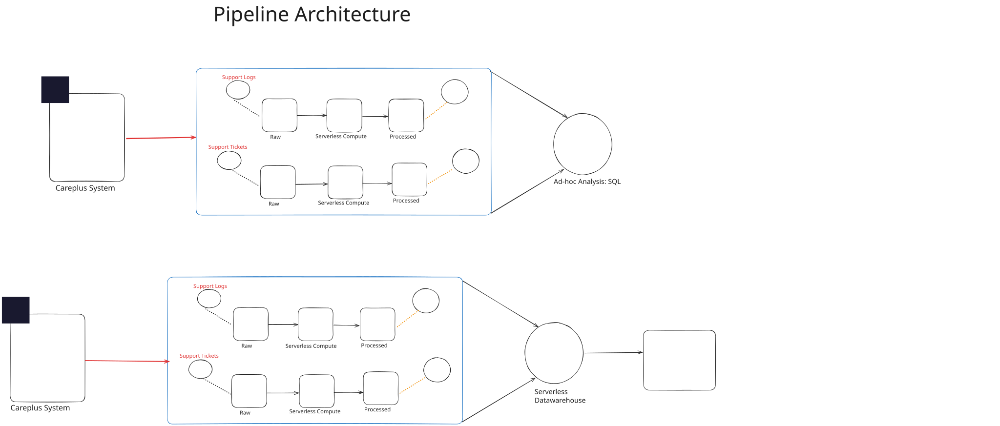

# Healthcare support analytics pipeline (AWS)

End-to-end pipeline for **support tickets** and **support logs**: ingest from operational sources into **Amazon S3**, transform to **Parquet**, load into **Amazon Redshift**, and analyze with **Amazon Athena** SQL. Includes optional **Lambda-style** handlers for event-driven processing.

## Objective

Demonstrate a practical **AWS data warehousing** pattern for healthcare-style support operations: reliable landing zones on S3, curated processed prefixes, relational loads into Redshift, and ad hoc analytics via Athena — with monitoring-friendly log and ticket domains.

## What this project demonstrates

- **Ingestion** — Incremental-style uploads of logs and ticket extracts to S3 (`data-ingestion/`).
- **Transformation** — Parsing, structuring, and Parquet writes suitable for downstream SQL engines (`data-transformation/`).
- **Warehousing** — Redshift table DDL, COPY from S3, and illustrative Athena queries (`data-warehousing-analytics/`).
- **Data model** — Documented relationship between tickets (header) and logs (detail); see `data-ingestion/meta_data.txt` and `careplus_support_db.sql`.

## Tech stack

| Area | Services / libraries |
|------|----------------------|
| Object storage | Amazon S3 |
| Compute / ETL | Python, boto3, pandas |
| Warehouse | Amazon Redshift Serverless (illustrative) |
| Query / catalog | Amazon Athena |
| Source (illustrative) | MySQL schema (`careplus_support_db.sql`) |

## Repository layout

| Path | Scope |
|------|--------|
| `data-ingestion/support-logs/` | Log file upload workflow to S3 |
| `data-ingestion/support-tickets/` | Ticket extract from MySQL to S3 |
| `data-transformation/` | Log / ticket ETL and Parquet publishing |
| `data-warehousing-analytics/redshift-setup/` | DDL, COPY patterns, notebook artifacts |
| `data-warehousing-analytics/athena-sql-queries/` | Example analytics SQL |
| `resources/` | Architecture diagram |
| `env.example` | Environment variable template (copy to `.env` locally) |

## Getting started

1. Copy `env.example` to `.env` and fill in credentials and resource names (**never commit `.env`**).
2. Install dependencies: `pip install -r requirements.txt`
3. Run notebooks or scripts from each folder in pipeline order: ingestion → transformation → warehouse steps as applicable to your AWS environment.

Place daily log files under `data-ingestion/support-logs/day-wise-logs-data/` locally if you run the log ingestion notebook; that folder is **gitignored**.

## Disclaimer

Synthetic / demo-style healthcare support scenario for portfolio purposes; adjust IAM roles, bucket names, and regions to match your AWS account.
